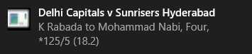

# Get Live IPL Updates


## Description
Run this script to get live notification on every **Four**, **Six** and fall of **Wicket** of Indian Premier League matches right on your desktop.
Notification will contain:
- Title of teams (Eg. Mumbai Indians vs. Chennai Super Kings)
- Activity of the ball (Eg. DJ Bravo to HH Pandya, Six)
- Current score with overs 

**Screenshots**

Linux


Windows



## Prerequisites
The Code is written in Python 3.7. If you don't have Python installed you can find it [here](https://www.python.org/downloads/). If you are using a lower version of Python you can upgrade using the pip package, ensuring you have the latest version of pip. 

To install pip run in the command Line
```
python -m ensurepip -- default-pip 
``` 
to upgrade it
```
python -m pip install -- upgrade pip setuptools wheel
```
to upgrade Python
```
pip install python -- upgrade
```
**Important**
Shoot this command to install additional required packages:
```
pip install argparse beautifulsoup4 html5lib plyer requests
```

## Run Script
Open Terminal or Command Prompt and type
```
python Get_Live_IPL_Updates.py
```

## Troubleshooting
If you are not getting current score along with the notification, you just need to pass an argument with the command.
```
python Get_Live_IPL_Updates.py --team=B
```
